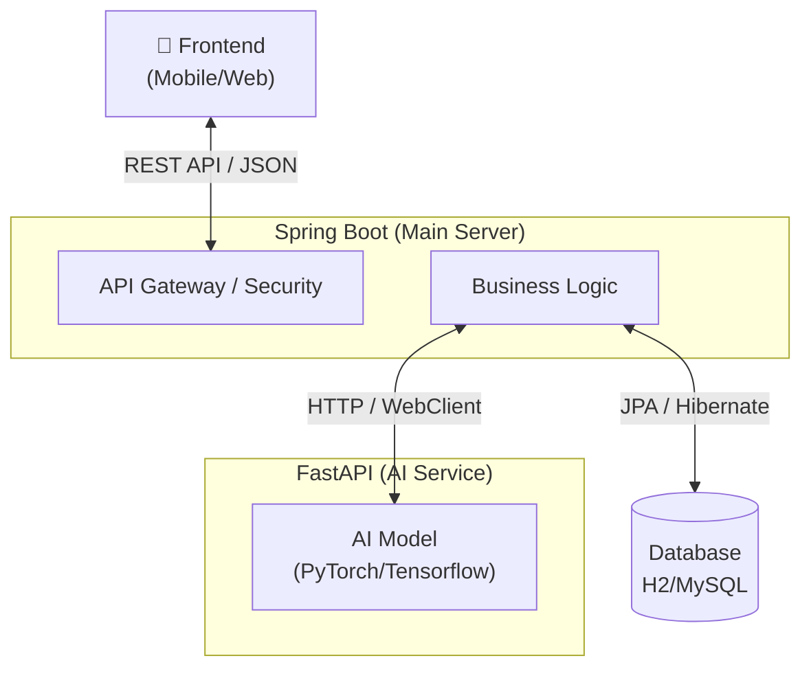
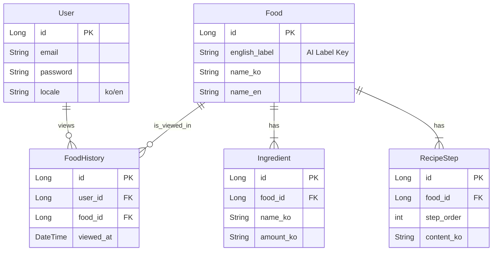

# 🍲 FoodDet: AI-Powered Korean Food Analysis Service

FoodDet은 사용자가 업로드한 음식 사진을 AI로 분석하여 음식명, 재료, 레시피 정보를 다국어(한국어/영어)로 제공하는 서비스입니다.

---

## 🏗️ 1. System Architecture

본 프로젝트는 **Client - API Gateway - AI Service**가 분리된 계층형 아키텍처(Layered Architecture)를 따릅니다.

### 🔹 Architecture Diagram

### 🔹 Components Description
| Component | Tech Stack | Description |
| :--- | :--- | :--- |
| **Client** | React / React Native | 사용자 인터페이스 및 이미지 업로드 처리 |
| **Main Server** | Spring Boot 3.x | 인증(JWT), 비즈니스 로직, DB 관리, AI 서버 통신 |
| **AI Service** | Python FastAPI | PyTorch 기반 이미지 분류 모델 서빙 (Inference) |
| **Database** | H2 / MySQL | 사용자 정보, 음식 데이터, 조회 기록 저장 |

---

## 💾 2. Data Architecture

데이터베이스는 사용자(User), 음식(Food), 기록(History)을 중심으로 설계된 관계형 데이터 모델(RDBMS)입니다.

### 🔹 ER Diagram (Entity Relationship)

### 🔹 Data Flow
1. **Image Upload**: 사용자가 이미지를 업로드합니다.
2. **AI Analysis**: Spring Boot가 FastAPI로 이미지를 전달하고, AI는 분석된 라벨(예: `kimchi_stew`)을 반환합니다.
3. **Data Mapping**: 반환된 라벨로 DB에서 `Food`, `Ingredient`, `RecipeStep` 정보를 조회합니다.
4. **History Save**: 로그인한 사용자라면 `FoodHistory` 테이블에 조회 기록을 저장합니다.
5. **Response**: 사용자의 언어 설정(`locale`)에 맞춰 번역된 데이터를 JSON으로 응답합니다.

---

## 🚀 Getting Started

### Prerequisites
- Java 17+
- Python 3.9+
- Node.js (for Frontend)

### Run Backend

