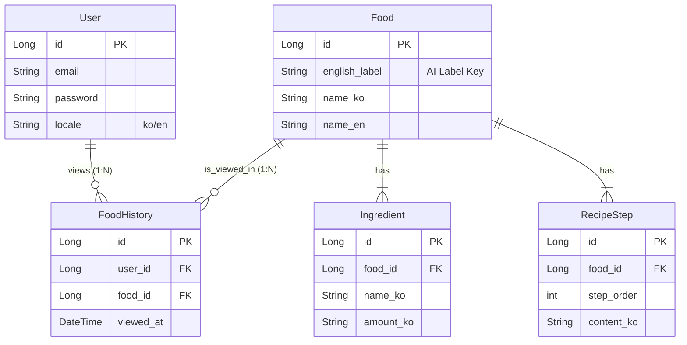

#  FoodDet: AI-Powered Korean Food Analysis Service

FoodDet은 사용자가 업로드한 음식 사진을 AI로 분석하여 음식명, 재료, 레시피 정보를 다국어(한국어/영어)로 제공하는 서비스입니다.

---

##  1. System Architecture

본 프로젝트는 **Client - API Gateway - AI Service**가 분리된 계층형 아키텍처(Layered Architecture)를 따릅니다.

### Architecture Diagram

###  Components Description
| Component | Tech Stack | Description |
| :--- | :--- | :--- |
| **Client** | React / React Native | 사용자 인터페이스 및 이미지 업로드 처리 |
| **Main Server** | Spring Boot 3.x | 인증(JWT), 비즈니스 로직, DB 관리, AI 서버 통신 |
| **AI Service** | Python FastAPI | PyTorch 기반 이미지 분류 모델 서빙 (Inference) |
| **Database** | H2 / MySQL | 사용자 정보, 음식 데이터, 조회 기록 저장 |

---

##  2. Data Architecture

데이터베이스는 사용자(User), 음식(Food), 기록(History)을 중심으로 설계된 관계형 데이터 모델(RDBMS)입니다.

### 🔹 ER Diagram (Entity Relationship)

### 🔹 Data Flow
1. **Image Upload**: 사용자가 이미지를 업로드합니다.
2. **AI Analysis**: Spring Boot가 FastAPI로 이미지를 전달하고, AI는 분석된 라벨(예: `kimchi_stew`)을 반환합니다.
3. **Data Mapping**: 반환된 라벨로 DB에서 `Food`, `Ingredient`, `RecipeStep` 정보를 조회합니다.
4. **History Save**: 로그인한 사용자라면 `FoodHistory` 테이블에 조회 기록을 저장합니다.
5. **Response**: 사용자의 언어 설정(`locale`)에 맞춰 번역된 데이터를 JSON으로 응답합니다.
---

### 🔹 Table Details & Relationships

#### 1️⃣ User (사용자 테이블)
서비스에 가입한 회원 정보를 저장하는 테이블입니다.
- **Relations**:
  - **1:N (일대다) with `FoodHistory`**: 한 명의 사용자는 여러 개의 조회 기록을 가질 수 있습니다.
- **Columns**: `id` (PK), `email` (ID), `password`, `locale` (언어 설정)

#### 2️⃣ Food (음식 테이블)
AI 모델이 분류할 수 있는 요리의 메인 정보를 담고 있는 테이블입니다.
- **Relations**:
  - **1:N (일대다) with `Ingredient`**: 하나의 음식은 여러 개의 재료 정보를 가집니다.
  - **1:N (일대다) with `RecipeStep`**: 하나의 음식은 여러 단계의 조리 순서를 가집니다.
  - **1:N (일대다) with `FoodHistory`**: 하나의 음식은 여러 사용자에 의해 조회될 수 있어, 여러 개의 기록 데이터를 생성합니다.
- **Columns**: `id` (PK), `english_label` (AI 라벨 매핑 키), `name_ko`/`name_en` (다국어 이름)

#### 3️⃣ Ingredient (재료 테이블)
각 음식에 들어가는 개별 재료 정보를 저장하는 테이블입니다.
- **Relations**:
  - **N:1 (다대일) with `Food`**: 여러 개의 재료가 하나의 음식에 소속됩니다.
- **Columns**: `id` (PK), `food_id` (FK), `name_ko`/`name_en` (재료명), `amount` (용량)

#### 4️⃣ RecipeStep (레시피 테이블)
음식을 만드는 조리 과정을 순서대로 저장하는 테이블입니다.
- **Relations**:
  - **N:1 (다대일) with `Food`**: 여러 단계의 조리 과정이 하나의 음식에 소속됩니다.
- **Columns**: `id` (PK), `food_id` (FK), `step_order` (순서), `content_ko`/`content_en` (내용)

#### 5️⃣ FoodHistory (조회 기록 테이블)
사용자가 언제 어떤 음식을 조회했는지 로그를 저장하는 테이블입니다. 사용자(`User`)와 음식(`Food`) 사이의 **N:M (다대다) 관계를 해소**하는 연결 테이블 역할을 합니다.
- **Relations**:
  - **N:1 (다대일) with `User`**: 이 기록은 특정 사용자 한 명에게 속합니다.
  - **N:1 (다대일) with `Food`**: 이 기록은 특정 음식 하나를 가리킵니다.
- **Columns**: `id` (PK), `user_id` (FK), `food_id` (FK), `viewed_at` (조회 일시)

## 📡 3. API Specification & Data Flow

프론트엔드(Client)와 백엔드(Server)는 **RESTful API**를 통해 통신하며, 데이터 형식은 주로 **JSON**을 사용합니다. 단, 이미지 업로드 시에는 `multipart/form-data`를 사용합니다.

### 🔹 Request & Response Format

| Feature | HTTP Method | Endpoint | Request Format | Response Format |
| :--- | :---: | :--- | :--- | :--- |
| **회원가입** | `POST` | `/auth/signup` | `JSON` (email, pw...) | `200 OK` (String) |
| **로그인** | `POST` | `/auth/login` | `JSON` (email, pw) | `JSON` (accessToken) |
| **내 정보 조회** | `GET` | `/api/users/me` | Header (Bearer Token) | `JSON` (User Info) |
| **이미지 분석** | `POST` | `/api/ai/predict` | `Multipart` (file, locale) | `JSON` (Food, Recipe...) |
| **기록 조회** | `GET` | `/api/users/me/history`| Header (Bearer Token) | `JSON` (History List) |

### 🔹 JSON Example (이미지 분석 결과)

### 🔹 Data Exchange Protocol
1.  **Client Request**: 
    - **Header**: `Content-Type: application/json` (일반), `Authorization: Bearer <token>` (인증 필요 시)
    - **Body**: JSON Data or FormData (Image)
2.  **Server Processing**:
    - `DTO` (Data Transfer Object) Pattern을 사용하여 요청 데이터를 검증(`@Valid`)하고 변환합니다.
3.  **Server Response**:
    - 성공 시: `200 OK`와 함께 JSON 데이터 반환
    - 실패 시: `4xx/5xx` 에러 코드와 함께 에러 메시지 반환 (`{ "error": "Invalid Token" }`)

## 🚀 Getting Started

### Prerequisites
- Java 17+
- Python 3.9+

### Run Backend

